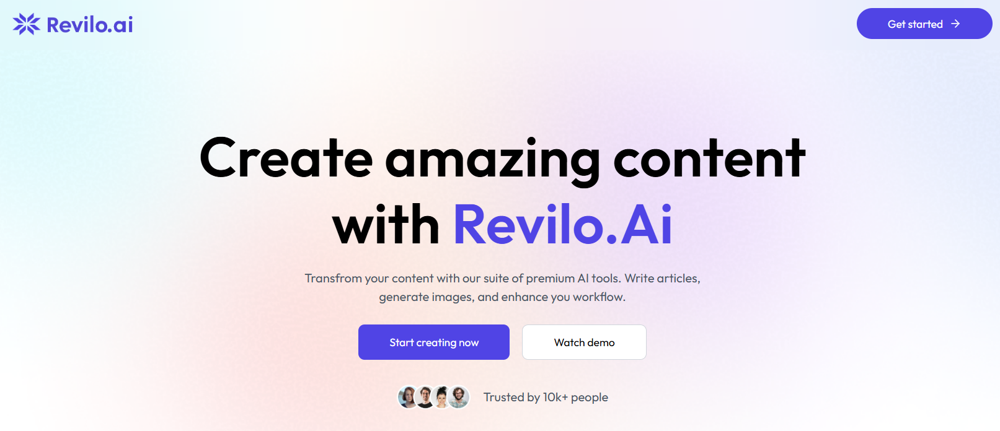

<div align="center">
  <br />
      
  <br />

  <div>
    
    
    
    
    <br/>
    
    
    
  </div>

  <h3 align="center">Revilo.AI — Your AI-Powered Productivity Engine</h3>
</div>


  <h3 align="center">Revilo.AI — Your AI-Powered Productivity Engine</h3>
</div>

## 📋 <a name="table">Table of Contents</a>

1. ✨ [Introduction](#introduction)
2. ⚙️ [Tech Stack](#tech-stack)
3. 🔋 [Features](#features)
4. 🤸 [Quick Start](#quick-start)


## <a name="introduction">✨ Introduction</a>

Revilo.AI is a next-gen AI SaaS application built with React, Express, Node.js, Clerk, Gemini, Cloudinary, Postgres (Neon), and Vercel to deliver powerful and seamless experiences. Designed for creators, professionals, and businesses, it offers a suite of intelligent tools that simplify everyday tasks. From article writing and blog title generation to image generation, background removal, and object removal, Revilo.AI empowers users with cutting-edge AI capabilities. 

Additionally, it provides resume review and career insights, making it a versatile platform for both creative and professional growth. With scalable infrastructure, secure authentication, and lightning-fast performance, Revilo.AI is your all-in-one AI-powered productivity hub.

## <a name="tech-stack">⚙️ Tech Stack</a>

- **[React](https://react.dev/)**  is a popular JavaScript library for building user interfaces. It enables developers to create fast, interactive, and scalable front-end applications using reusable components and a virtual DOM for efficient rendering. 

- **[TailwindCSS](https://tailwindcss.com/)** is a utility-first CSS framework that allows developers to build custom, responsive designs quickly without leaving their HTML. It provides pre-defined classes for layout, typography, colors, and more.

- **[Express](https://expressjs.com/)**  is a minimal and flexible Node.js web framework. It simplifies building robust APIs and backends by providing powerful middleware support, routing, and HTTP utility methods.

- **[Node.js](https://nodejs.org/)**  is a runtime environment for executing JavaScript outside the browser. It is widely used for building scalable server-side applications, real-time services, and APIs.

- **[Clerk](https://clerk.com/)**  provides authentication and user management solutions for modern applications. It supports email/password, social login, multi-factor authentication, and customizable UI components for secure identity management. 

- **[Gemini](https://ai.google.dev/gemini-api/)**  is Google’s multimodal AI model offering advanced capabilities in text, code, and image processing. It enables intelligent features like content generation, analysis, and automation in applications. 

- **[Cloudinary](https://cloudinary.com/)**  is a cloud-based image and video management service. It offers media upload, transformation, optimization, and delivery at scale, making it ideal for modern apps needing dynamic media handling.  

- **[Postgres (Neon)](https://neon.tech/)**  is a serverless Postgres database platform. It provides scalable, cost-efficient, and developer-friendly database solutions with features like branching, autoscaling, and built-in backups.  

- **[Vercel](https://vercel.com/)**  is a cloud platform for deploying and scaling web applications. It provides seamless CI/CD, global edge infrastructure, and optimized hosting for frameworks like Next.js and React.


## <a name="features">🔋 Features</a>

👉 **AI Article Generation**: Craft high-quality, SEO-friendly articles in seconds with AI-powered content writing, tailored to your niche and tone of voice.

👉 **Blog Title Generation**: Instantly create catchy, engaging, and keyword-optimized blog titles that improve click-through rates and attract readers.

👉 **AI Image Generation**: Generate stunning visuals from text prompts, helping creators, marketers, and businesses produce original graphics effortlessly.

👉 **Background Removal**: Automatically remove image backgrounds with precision, making product photos, presentations, and creative assets look professional.

👉 **Object Removal**: Erase unwanted elements from images seamlessly, maintaining natural quality without complex photo-editing tools.

👉 **Resume Review**: Get AI-driven insights on your resume, including structure, wording, and impact, to boost your chances of landing interviews.

👉 **Seamless Cloud Media Management**: Powered by Cloudinary, upload, optimize, and deliver media instantly across devices with minimal effort.

And many more, including code architecture and reusability.

## <a name="quick-start">🤸 Quick Start</a>

Follow these steps to set up the project locally on your machine.

**Prerequisites**

Make sure you have the following installed on your machine:

- [Git](https://git-scm.com/)
- [Node.js](https://nodejs.org/en)
- [npm](https://www.npmjs.com/) (Node Package Manager)

**Cloning the Repository**

```bash
git clone https://github.com/Shaizaan-Hussain/Revilo-AI.git
cd revilo_ai
```

**Installation**

Install the project dependencies using npm:

```bash
npm install
```

**Set Up Environment Variables**

Create a new file named `.env` in the root of your project and add the following content:

```env
VITE_CLERK_PUBLISHABLE_KEY=
VITE_BASE_URL = http://localhost:3000

# Clerk
CLERK_PUBLISHABLE_KEY=
CLERK_SECRET_KEY=

# Neon
DATABASE_UR=

# Clipboard
CLIPDROP_API_KEY =

# GEMINI
GEMINI_API_KEY=

#Cloudinary 
CLOUDINARY_CLOUD_NAME =
CLOUDINARY_API_KEY =
CLOUDINARY_API_SECRET =
```

Replace the placeholder values with your real credentials. 

**Running the Project**

```bash
npm run dev
```

Open [http://localhost:3000](http://localhost:3000) in your browser to view the project.


